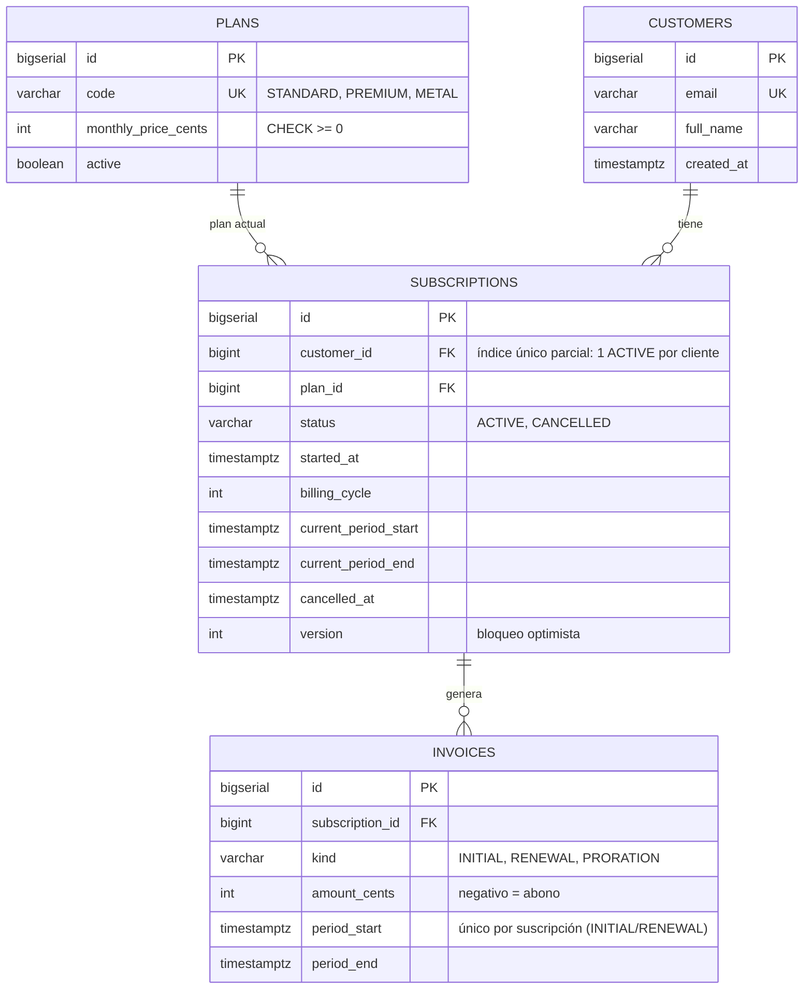

# Subscriptions API · Spring Boot + PostgreSQL

[](https://github.com/jimmyrom1/subscriptions-api/actions/workflows/ci.yml)

API REST para gestionar suscripciones de pago al estilo de un banco digital, con planes Standard,
Premium y Metal. Incluye altas, cambios de plan con prorrateo, cancelación al final del periodo y
facturación mensual automática e idempotente.

**Stack:** Java 21 · Spring Boot 4.1 · Spring Data JPA · PostgreSQL 16 · Flyway ·
Testcontainers · JaCoCo · springdoc-openapi · Docker · GitHub Actions

## Arrancar

```bash
docker compose up --build
```

- API: <http://localhost:8080/api/plans>
- Swagger UI: <http://localhost:8080/swagger-ui.html>
- Health: <http://localhost:8080/actuator/health>

Sin Docker necesitas Java 21 y un PostgreSQL con la base de datos `subscriptions` (usuario y
contraseña `app`). Después ejecuta `./mvnw spring-boot:run`.

## Modelo de datos



## API

| Método | Ruta | Qué hace |
| --- | --- | --- |
| `GET` | `/api/plans` | Planes activos |
| `POST` | `/api/customers` | Crea un cliente |
| `GET` | `/api/customers/{id}` | Detalle del cliente |
| `POST` | `/api/customers/{id}/subscriptions` | Suscribe a un plan (`{"planCode": "PREMIUM"}`) |
| `GET` | `/api/customers/{id}/subscription` | Suscripción activa del cliente |
| `GET` | `/api/subscriptions/{id}` | Detalle de la suscripción |
| `PUT` | `/api/subscriptions/{id}/plan` | Cambia de plan y devuelve la factura de prorrateo |
| `POST` | `/api/subscriptions/{id}/cancel` | Cancela al final del periodo |
| `GET` | `/api/customers/{id}/invoices` | Historial de facturas |

Todos los errores tienen el mismo formato:

```json
{ "code": "ACTIVE_SUBSCRIPTION_EXISTS", "message": "El cliente ya tiene una suscripción activa",
  "timestamp": "2026-09-26T23:42:55.963Z" }
```

## Reglas de negocio

1. **Un cliente solo puede tener una suscripción `ACTIVE`.** Si intenta suscribirse otra vez,
   recibe `409 ACTIVE_SUBSCRIPTION_EXISTS`.
2. **El cambio de plan se aplica al instante** y genera una factura `PRORATION` por la diferencia
   de precio en la parte del periodo que queda. En un downgrade el importe es negativo (un abono).
3. **La cancelación surte efecto al final del periodo.** La suscripción sigue `ACTIVE`, con
   `cancelAtPeriodEnd: true`, hasta `current_period_end`. Entonces la renovación la pasa a
   `CANCELLED` y no factura nada más.
4. **No se puede pasar a un plan inactivo ni al mismo plan:** `422 PLAN_INACTIVE` o
   `422 SAME_PLAN`. Tampoco se puede cambiar de plan con la cancelación ya programada:
   `409 CANCELLATION_SCHEDULED`.
5. **Renovación diaria a las 02:00** (`billing.renewal-cron`). Por cada suscripción vencida se
   emite la factura del periodo siguiente y se avanza el periodo, todo en una sola transacción.

## Decisiones de diseño

### Dinero en céntimos (`INT`), nunca `double`
`0.1 + 0.2 != 0.3` en coma flotante. Los importes son enteros en céntimos. El prorrateo usa
`BigDecimal` y redondea (`HALF_UP`) una única vez, al final
([`Proration`](src/main/java/com/jose/subscriptions/subscription/Proration.java)).

### Índice único parcial para "una suscripción activa"
```sql
CREATE UNIQUE INDEX one_active_sub_per_customer ON subscriptions (customer_id) WHERE status = 'ACTIVE';
```
El servicio comprueba la regla y devuelve un 409 claro. Pero entre esa comprobación y el `INSERT`
puede colarse otra petición, así que la garantía real la da la base de datos. Un test lanza
8 altas simultáneas para el mismo cliente y comprueba que solo entra una. Al ser un índice
parcial, las suscripciones `CANCELLED` no cuentan: el cliente puede volver a darse de alta.

### Facturación idempotente
```sql
CREATE UNIQUE INDEX one_invoice_per_period
  ON invoices (subscription_id, period_start) WHERE kind IN ('INITIAL', 'RENEWAL');
```
Si el scheduler se ejecuta dos veces (un reintento, o varias instancias con el mismo cron), la
segunda renovación del mismo periodo choca con este índice o con el `@Version` de la suscripción.
Esa transacción hace rollback completo y el scheduler lo registra en el log como "ya renovada",
no como error. Un test lanza 4 ejecuciones concurrentes sobre 5 suscripciones y comprueba que
salen exactamente 5 facturas de renovación.

El plan original proponía un `UNIQUE (subscription_id, period_start)` sobre todas las facturas.
Los tests destaparon que así un cambio de plan en el mismo instante que otro (o justo tras el
alta) chocaba con una factura legítima. Por eso el índice es parcial y solo cubre las facturas
de periodo.

### Periodos anclados a la fecha de alta
El fin del periodo *n* se calcula como `started_at + n meses` (columna `billing_cycle`), no
sumando un mes al fin anterior. Si no, un alta el 31 de enero acabaría facturándose el día 28
de cada mes: 31 ene → 28 feb → 28 mar. Con el anclaje, las fechas son 28 feb → 31 mar → 30 abr.
Si el proceso estuvo parado, una sola ejecución pone al día todos los periodos pendientes.

### Flyway y `ddl-auto: validate`
El esquema está versionado en `src/main/resources/db/migration`. Hibernate nunca lo modifica:
solo valida que las entidades encajan, y si no encajan la aplicación no arranca. Así la base de
datos de producción no cambia sin una migración revisada.

### El tiempo es una dependencia
Se inyecta un `Clock` en lugar de llamar a `Instant.now()`. Los tests mueven el reloj para simular
meses enteros. El reloj va truncado a microsegundos, la precisión de `TIMESTAMPTZ`: así un
instante recién creado y el mismo instante leído de la base de datos coinciden.

### Estructura por funcionalidad
```
com.jose.subscriptions
├── plan/          Plan, PlanRepository, PlanController
├── customer/      Customer, CustomerRepository, CustomerService, CustomerController
├── subscription/  Subscription, SubscriptionService, Proration, SubscriptionController, dto/
├── billing/       Invoice, InvoiceRepository, BillingService, BillingScheduler, InvoiceController
└── common/        GlobalExceptionHandler, ApiError, BusinessException, ClockConfig
```
Otros detalles:
- DTOs como `record`: las entidades nunca salen del servicio.
- Inyección por constructor.
- `@Transactional` en los servicios.
- Excepciones de negocio `sealed` con su código HTTP (404, 409 o 422).
- El scheduler no es transaccional: cada suscripción se renueva en su propia transacción.
- No se usa Lombok: con `record` y Java 21 apenas aporta.

## Tests

```bash
./mvnw verify
```

| Tipo | Qué cubre |
| --- | --- |
| Unitarios (JUnit 5 + Mockito) | Prorrateo, redondeo, anclaje de periodos y reglas del `SubscriptionService` |
| Integración (`*IT`, PostgreSQL real) | Flujo HTTP completo, 409 por duplicado, prorrateo, cancelación, renovación, idempotencia con ejecuciones concurrentes, validación y errores JSON |

- **Base de datos de los tests:** los de integración arrancan PostgreSQL con Testcontainers. En
  una máquina sin Docker se puede usar una base de datos local:
  `TEST_DATABASE_URL=jdbc:postgresql://localhost:5432/subscriptions_test ./mvnw verify`.
- **Cobertura:** JaCoCo junta la cobertura de los dos tipos de test y exige un mínimo del 80 % de
  líneas en cada `*Service`. Ahora mismo está en torno al 96 % en total.
- **CI:** en cada push, GitHub Actions ejecuta `mvn verify` y un smoke test del
  `docker compose` completo.

## Qué haría después

- **Eventos:** publicar `SubscriptionCancelled` o `InvoiceIssued` con un *outbox* transaccional
  y Kafka, para que otros servicios (notificaciones, contabilidad) reaccionen sin acoplarse.
- **Pagos:** integrar Stripe, con un estado `PAST_DUE` y reintentos cuando falla un cobro.
- **Seguridad:** Spring Security con JWT, de modo que cada cliente solo vea sus datos.
- **Despliegue:** AWS (App Runner o ECS + RDS) con las migraciones de Flyway en el arranque.
- **Scheduler con varias instancias:** ShedLock, para que solo una ejecute el cron. La
  idempotencia ya evita duplicados, pero así no se hace trabajo de más.
